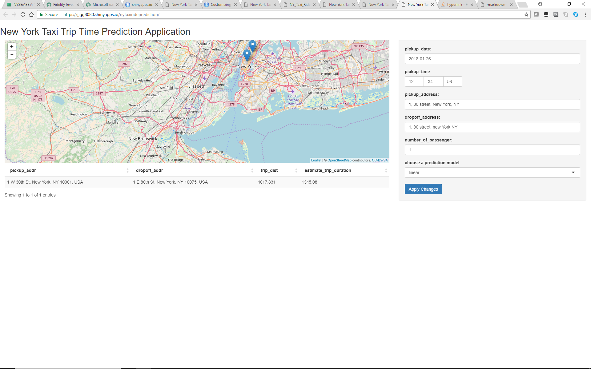

## Getting Started

The New York Taxi Dataset is a open dataset which contains the information of New York Taxi ride in 2016. 

This web application is using the model derived from dataset and predict the trip duration by user given input.

    The application is located at (https://jjgg8080.shinyapps.io/nytaxirideprediction).

To get started, please input an valid pickup / dropoff address in New York City. 
 

## User Input Columns Processing

The following columns are input from user and transformed.

* Pickup Date time 
* Pickup Lagitude Longitude
* Drop off Lagitude Longitude
* Number of Passenger
* Model Selection


## Sample User input code

```{r user_input_processing, eval=FALSE, echo=TRUE}

ui <- bootstrapPage(
   sidebarPanel ( 
      dateInput("p1", "pickup_date:"), value= as.character(now())
      ,
      timeInput("t1", "pickup_time", value = strptime("12:34:56", "%H:%M:%S"))
      ,
      textInput("pa1", "pickup_address:", value="1, 30 street, New York, NY")
      ,
      textInput("dr1", "dropoff_address:", value="1, 80 street, new York NY")
      ,
      numericInput("ps1", "number_of_passenger:", value=1)
      ,
      selectInput("modelInput", "choose a prediction model",
                  choices= c("xgb",
                             "linear"), multiple=FALSE, selected="linear")
      ,
      submitButton()
   )
)
```

## Trip Duration Prediction

The following outcome columns are displayed as outcome. The map also interactively shows the pickup/drop off location.

- trip duration
- estimated time to travel (in seconds)

The shiny server will calculate the estimated time to travel depending on user input.
It also uses the leaflet to display marker on the pickup/dropoff location.

```{r, echo=TRUE, eval=FALSE, fig.height=4, fig.width=6}
output$result <- renderDataTable({
        d <- getInput() %>% 
            dplyr::select(pickup_address, dropoff_address,
                          trip_distance)
        t <- round(predictTripTime(getInput(), input$modelInput)$trip_duration, digits=2)
        ret <- as.data.frame(as.matrix(cbind(d, t),ncol=4))
        names(ret) <- c("pickup_addr", "dropoff_addr", "trip_dist", "estimate_trip_duration(s)")
        ret
    }, options = list(lengthChange = TRUE, paging=FALSE, searching=FALSE)
    )
```


